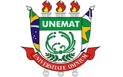

::: {.logo-topo}
{width="110"}
:::

No ano-base 2024, a Lei do Bem amparou **R\$ 51,6 bilhões** de dispêndio em pesquisa e desenvolvimento declarados por mais de 4.200 empresas, ao custo de cerca de **R\$ 12 bilhões** de renúncia fiscal. Esse número diz quanto foi gasto. Não diz se o incentivo comprou pesquisa que não aconteceria de qualquer forma.

Esta disciplina gira em torno de duas perguntas, e a segunda só existe por causa da primeira:

> **De onde vem o dinheiro de um projeto de inovação — e o que ele cobra em troca?**
>
> **Como se sabe se aquele dinheiro fez diferença?**

Um projeto de inovação raramente é pago só com o caixa da empresa. Ele é montado juntando peças: uma chamada da FAPEMAT, uma linha do Desenvolve MT, o abatimento da Lei do Bem, um contrato com a Unidade EMBRAPII do IFMT. Saber quais peças existem, qual serve ao estágio do seu projeto e o que cada uma cobra é o que separa um projeto financiado de um projeto engavetado.

::: {.callout-tip}
## Aulas e Catálogo — qual é a diferença

As **aulas** argumentam. Cada página traz por extenso o conteúdo de um bloco do encontro síncrono: o raciocínio, os exemplos, os números. Você lê antes para chegar preparado e depois para revisar — a aula não é a única chance de aprender aquilo.

O **catálogo** consulta. São fichas de instrumentos: quem pode acessar, quanto, que contrapartida cobra, qual o prazo e onde encontrar a chamada. Não se lê de ponta a ponta; abre-se quando há uma decisão a tomar. É a parte do site que continua útil depois que a disciplina acabar.
:::

## Como funciona

| | |
|---|---|
| **Encontros síncronos** | Sábados **12/09** e **26/09**, das **8h às 12h** e das **14h às 18h**, por Google Meet |
| **Fora dos encontros** | 14 horas de leitura, laboratórios e produção do trabalho final, no seu ritmo |
| **Avaliação** | Um único trabalho final, entregue em PDF na tarefa aberta no SIGAA |
| **Gravações** | Publicadas no SIGAA após cada encontro |

Nos encontros **não se repete o que já está escrito aqui**. O tempo ao vivo é para discussão, casos em grupo, leitura de editais reais e a oficina do trabalho final. Quem chega sem ter lido acompanha pior — e essa é a regra, não a punição.

## Aulas

### Sábado 1 · 12/09 — Por que existe esse dinheiro

| # | Página | O que discute |
|---|---|---|
| 1 | [Políticas públicas: conceito e ciclo](s1-01-politicas-publicas.qmd) | Por que o Estado financia pesquisa que a empresa poderia pagar sozinha |
| 2 | [O sistema brasileiro de CT&I](s1-02-sistema-cti.qmd) | Quem é quem: MCTI, FINEP, CNPq, BNDES, EMBRAPII, FAPEMAT, ICTs e NITs |
| 3 | [Avaliação: o que o financiador cobra](s1-03-avaliacao.qmd) | Teoria de mudança, indicadores e por que monitoramento não é avaliação |
| 4 | [O contrafactual](s1-04-contrafactual.qmd) | Por que "quem usou o incentivo inova mais" não prova nada |

### Sábado 2 · 26/09 — De onde vem o dinheiro

| # | Página | O que discute |
|---|---|---|
| 5 | [Fomento não reembolsável](s2-01-nao-reembolsavel.qmd) | Subvenção, editais e como se lê um edital de verdade |
| 6 | [EMBRAPII: o instrumento sem edital](s2-02-embrapii.qmd) | Cofinanciamento, contrapartida em dinheiro e a Unidade do IFMT |
| 7 | [Incentivos fiscais](s2-03-incentivos-fiscais.qmd) | Lei do Bem, Lei de TICs e encomenda tecnológica |
| 8 | [Crédito e capital privado](s2-04-credito-e-capital-privado.qmd) | Dívida, equity e quando um projeto **não** é caso de venture capital |

## Catálogo de instrumentos

| Página | O que traz |
|---|---|
| [A escada do financiamento](cat-escada.qmd) | A matriz instrumento × estágio e o que está aberto agora |
| [Não reembolsável](cat-nao-reembolsavel.qmd) não volta | EMBRAPII, FINEP, CNPq, FAPEMAT, Centelha, Sebraetec |
| [Incentivos fiscais](cat-fiscais.qmd) o Estado abre mão | Lei do Bem, Lei de TICs, encomenda tecnológica |
| [Crédito](cat-credito.qmd) dívida | Desenvolve MT, FINEP Inovacred, BNDES |
| [Capital privado](cat-privado.qmd) participação | Investidor-anjo, aceleradora, venture capital, equity crowdfunding |

::: {.callout-important}
## A cor diz o que o dinheiro cobra

Ao longo de todo o site, quatro cores marcam a **natureza** de cada instrumento. Recurso não reembolsável não volta, mas exige contrapartida em dinheiro e prestação de contas. Benefício fiscal depende do regime tributário da empresa. Crédito cobra juros e garantias. Equity não se paga — custa participação na empresa.

Não existe dinheiro sem contrapartida. Muda apenas a moeda em que se paga.
:::

## Laboratórios

O R roda **no seu navegador**: basta clicar em **Run Code**. Nada para instalar, nenhuma conta para criar. Não valem nota — servem para você conseguir defender os números do seu trabalho final.

| # | Laboratório | O que responde |
|---|---|---|
| 1 | [Explorando os dados de um programa](lab01-explorando-dados.qmd) | Quem são os beneficiários? A diferença bruta mede o efeito? |
| 2 | [Diferenças-em-diferenças](lab02-did.qmd) | O incentivo aumentou mesmo o investimento em P&D? |
| 3 | [Vale a pena? VPL, TIR e payback](lab03-vpl-tir.qmd) | O projeto se paga? Em quanto tempo? |
| 4 | [O custo real de cada fonte](lab04-custo-das-fontes.qmd) | Subvenção, crédito ou equity: com qual sobra mais para o dono? |

::: {.callout-important}
## A primeira execução precisa de internet — e demora

Ao clicar em **Run Code** pela primeira vez, o navegador baixa o R compilado para WebAssembly (cerca de 30 MB) do servidor do projeto webR. Isso acontece **uma vez por navegador**; depois fica em cache e a execução é instantânea.

Consequências práticas: a primeira execução leva de alguns segundos a alguns minutos, conforme a conexão, e **não funciona offline**. Se você vai fazer os laboratórios num lugar de conexão ruim, abra a página e rode o primeiro bloco antes — deixe carregar enquanto faz outra coisa.
:::

## Avaliação

| Página | O que é |
|---|---|
| [Os dez casos](casos.qmd) | As empresas fictícias entre as quais você escolhe a sua |
| [Mapa de instrumentos](atividade-mapa.qmd) | Atividade em grupo do primeiro sábado — seis situações e a porta certa para cada uma |
| [O caso da Lei do Bem](caso-lei-do-bem.qmd) | Atividade em grupo do primeiro sábado — quatro números e o contrafactual |
| [Esta empresa pode usar a Lei do Bem?](atividade-elegibilidade.qmd) | Atividade em grupo do segundo sábado — cinco perfis e o teste de elegibilidade |
| [Trabalho final](trabalho-final.qmd) | Roteiro, rubrica e prazo do plano de captação de recursos |

## Slides

Os slides usados nos encontros. Não substituem as páginas de aula — são o roteiro de condução, com as perguntas, os números e as instruções das atividades.

| Encontro | Slides |
|---|---|
| Sábado 1 · 12/09 | [Por que existe esse dinheiro](slides-s1.qmd) |
| Sábado 2 · 26/09 | [De onde vem o dinheiro](slides-s2.qmd) |

## Leituras

A página de [leituras](leituras.qmd) reúne as fontes que sustentam o site: os estudos de avaliação da Lei do Bem, os manuais e as normas, e a bibliografia da ficha da disciplina. Só há **uma leitura obrigatória** em toda a disciplina, e ela está lá.

::: {.callout-note}
## Como usar este site

**Antes de cada sábado**, leia as quatro páginas de aula daquele encontro. São textos, não slides — foram escritos para serem lidos sozinho.

**Nos laboratórios**, rode os blocos **na ordem**: os primeiros carregam os dados usados pelos seguintes. Os exercícios têm **Dica** e **Solução** — tente antes de abrir a solução.

**No catálogo**, confira sempre o prazo antes de contar com um instrumento. Chamada fecha, e as condições de crédito mudaram duas vezes nos últimos dezoito meses. Cada ficha diz de quando é a informação.
:::
